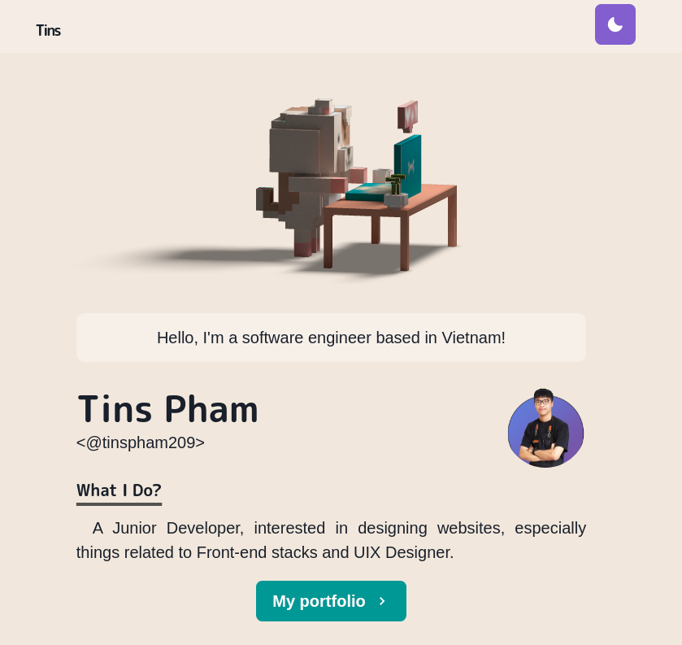

# Tin Pham's portfolio

[https://tinspham.dev/](https://tinspham.dev/)

## Stack

- [Next.js](https://nextjs.org/) - A React framework with hybrid static & server rendering, and route pre-fetching, etc.
- [Chakra UI](https://chakra-ui.com/) - A simple, modular and accessible component library for React
- [Three.js](https://threejs.org/) - 3D library for JavaScript
- [Framer Motion](https://www.framer.com/motion/) - An animation library for React
- [Spline](https://spline.design/) - Designing in 3D and export to React component



## Project structure

```
$PROJECT_ROOT
│   # Page files
├── pages
│   # React component files
├── components
│   # Non-react modules
├── lib
│   # Static files for images and 3d model file
└── public
```

## Install dependencies:

```
npm install

//On Powershell
$env:NODE_OPTIONS = "--openssl-legacy-provider"

npm run dev
```

## Need to READ
- View image in `localhost`
  - please hide this object `images` in file `next.config.js`
```
  // images: {
  //   loader: 'imgix'
  // path: 'https://tinspham.dev/'
  // },
```
- After that, pre-commit, please show object `images` again to view it in website

## Deploy:

- CI:
  - push commit to branch `master`

- Manual:
```
firebase init
  - select public folder is out
npm run deploy
or
npm run build
npm run export
firebase deploy
```


